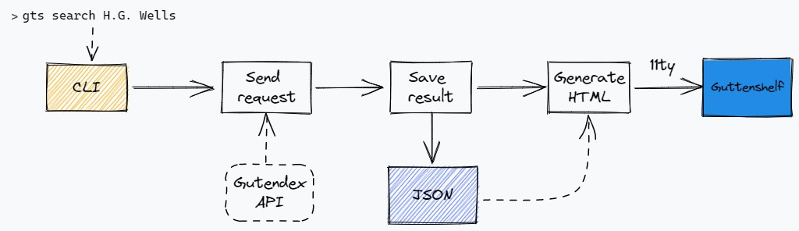

# Gutenshelf

Tool to create a digital bookshelf from search results on Gutenberg library 

# Screenshots


# Features

* Search by author/title or topic
* Book Gallery UI
* Side navigation by topic
* Preview locally

# Demo
[Virtual bookshelf created from "gts search H. G. Wells"](https://steady-truffle-26163f.netlify.app/)

# Getting Started

Install the command-line tool:

```
npm install -g
```

## Commands at a glance

| command                | description                                       |
| ---------------------- | ------------------------------------------------- |
| search                 |  Use a search term to match any author and title  |
| topic                  |  Use a search term to get book entries by topic   |

# Usage

## `search <search term>`

Send the search term to the gutendex API and save the results to create/show a new digital bookshelf

## `topic <search term>`

Send the search term to the gutendex API looking for matches on topics, then save the results to create/show a new digital bookshelf

### Options

- `--port <port>`
- `--noserve`

# Design


# Tech
Node, Eleventy, JS

# Related
* [Project Gutenberg](https://www.gutenberg.org/)
* [Gutendex](https://gutendex.com/)